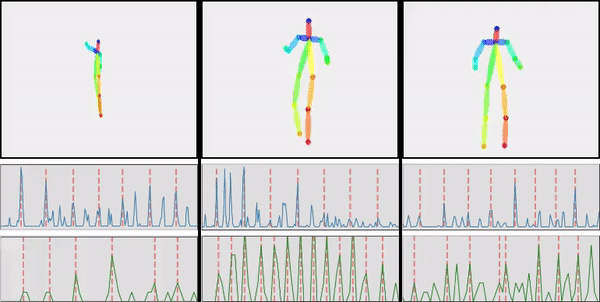
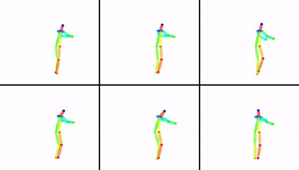
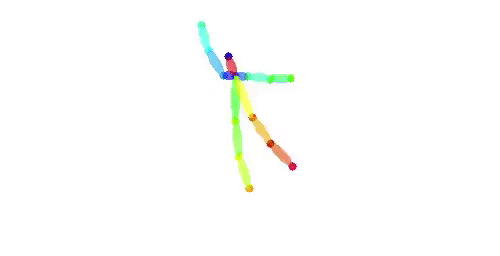
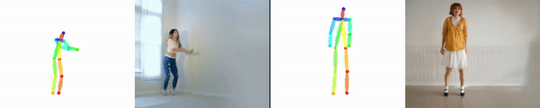

## Dancing to Music
PyTorch implementation of the cross-modality generative model that synthesizes dance from music.


### Paper 
[Hsin-Ying Lee](http://vllab.ucmerced.edu/hylee/), [Xiaodong Yang](https://xiaodongyang.org/), [Ming-Yu Liu](http://mingyuliu.net/), [Ting-Chun Wang](https://tcwang0509.github.io/), [Yu-Ding Lu](https://jonlu0602.github.io/), [Ming-Hsuan Yang](https://faculty.ucmerced.edu/mhyang/), [Jan Kautz](http://jankautz.com/)  
Dancing to Music
Neural Information Processing Systems (**NeurIPS**) 2019     
[[Paper]](https://arxiv.org/abs/1911.02001) [[YouTube]](https://youtu.be/-e9USqfwZ4A) [[Project]](http://vllab.ucmerced.edu/hylee/Dancing2Music/script.txt) [[Blog]](https://news.developer.nvidia.com/nvidia-dance-to-music-neurips/) [[Supp]](http://xiaodongyang.org/publications/papers/dance2music-supp-neurips19.pdf)

### Example Videos
- Beat-Matching     
1st row: generated dance sequences, 2nd row: music beats, 3rd row: kinematics beats         
<p align='left'>
  
</p>

- Multimodality    
Generate various dance sequences with the same music and the same initial pose. 
<p align='left'>
  
</p>

- Long-Term Generation    
Seamlessly generate a dance sequence with arbitrary length. 
<p align='left'>
  <kbd>
   
  </kbd>
</p>

- Photo-Realisitc Videos    
Map generated dance sequences to photo-realistic videos.
<p align='left'>
  
</p>


## Train Decomposition 
```
python train_decomp.py --name Decomp
```

## Train Composition 
```
python train_comp.py --name Decomp --decomp_snapshot DECOMP_SNAPSHOT
```

## Demo
```
python demo.py --decomp_snapshot DECOMP_SNAPSHOT --comp_snapshot COMP_SNAPSHOT --aud_path AUD_PATH --out_file OUT_FILE --out_dir OUT_DIR --thr THR
```
- Flags
  - `aud_path`: input .wav file
  - `out_file`: location of output .mp4 file
  - `out_dir`: directory of output frames
  - `thr`: threshold based on motion magnitude
  - `modulate`: whether to do beat warping

- Example
```
python demo.py -decomp_snapshot snapshot/Stage1.ckpt --comp_snapshot snapshot/Stage2.ckpt --aud_path demo/demo.wav --out_file demo/out.mp4 --out_dir demo/out_frame
```


### Citation
If you find this code useful for your research, please cite our paper:
```bibtex
@inproceedings{lee2019dancing2music,
  title={Dancing to Music},
  author={Lee, Hsin-Ying and Yang, Xiaodong and Liu, Ming-Yu and Wang, Ting-Chun and Lu, Yu-Ding and Yang, Ming-Hsuan and Kautz, Jan},
  booktitle={NeurIPS},
  year={2019}
}
```

### License
Copyright (C) 2020 NVIDIA Corporation. All rights reserved. This work is made available under NVIDIA Source Code License (1-Way Commercial). To view a copy of this license, visit https://nvlabs.github.io/Dancing2Music/LICENSE.txt


